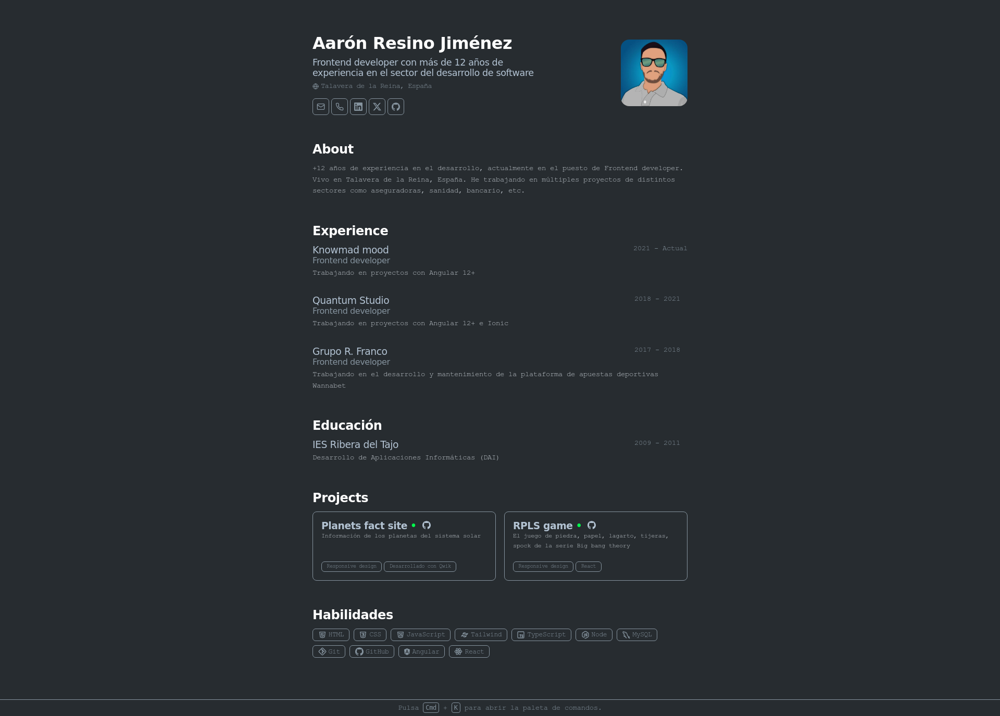

<div align="center">
  <h2>
    Mi portfolio
  </h2>
</div>

<p></p>

</img>

## 🛠️ Stack

- [**Astro**](https://astro.build/) - El framework web de la nueva época.
- [**Typescript**](https://www.typescriptlang.org/) - JavaScript con sintaxis de tipado.
- [**Ninja Keys**](https://github.com/ssleptsov/ninja-keys) - Menu desplegable con atajos de teclado hecho en puro Javascript.

## 🚀 Empezar

### 1. Añade tu contenido:
Edita el archivo `cv.json` para crear tu propio Portafolio/CV imprimible.
### 2. Lanza el servidor de desarrollo:

```bash
# Disfruta del resultado
pnpm dev
```


1. Abre [**http://localhost:4321**](http://localhost:4321/) en tu navegador para ver el resultado 🚀


## 🧞 Comandos

|     | Comando          | Acción                                        |
| :-- | :--------------- | :-------------------------------------------- |
| ⚙️  | `dev` o `start` | Lanza un servidor de desarrollo local en  `localhost:4321`.  |
| ⚙️  | `build`          | Comprueba posibles errores y hace un empaquetado de producción en `./dist/`.      |
| ⚙️  | `preview`        | Vista previa en local `localhost:4321` |


## 🔑 Licencia

[MIT](LICENSE.txt).
